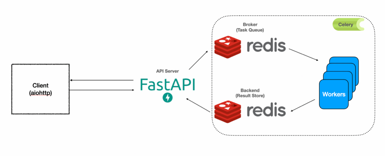

# 🛠🥑 Technical test for picsellia

This _README.md_ aims to provide all the information related to the technical test that Picsellia provided.

## 1. Installation

To run the project, make sure that _Docker_ is installed. Then, just run:

```bash
docker-compose build
docker-compose up
```

The application will run on the port 8011.

## 2. Roadmap

Here is the list of the features I've developed and what I would have done with more time:

- ✅ Uploading an image.
- ✅ Making a prediction (the prediction is mocked -> a random square is used as the prediction mask).
- ✅ Returning the vertices of the outlines of all objects.
- ✅ Code deployed within the provided server.
- ✅ (Bonus) Asynchronous predictions.
- ✅ (Bonus) Optimized Docker images.
- ⚠️ (TODO) Unit tests.
- ⚠️ (TODO) Logging improvements.
- ⚠️ (TODO) Download a real segmentation model during container startup.
- 🔍 Monitoring strategy (check bellow).

Regarding the TODOs, those are the elements I deprioritized in my ~2 hours time frame. More explanations will be given
during the technical interview.

## 3. Architecture

To prepare this interview, I've created a _FastAPI_ API, coupled with a _Celery_ worker and _Redis_ as a message broker.
The architecture can be summarized as below:



- The image is uploaded, serialized in a base64 format and sent to an available worker.
- The worker makes the prediction, computes the objects' outlines' vertices and returns the result.

## 4. Monitoring strategy

There are multiple ways to implement a monitoring strategy for this application. We also need to remember that multiple
monitoring strategies exist with different purposes as well. For this exercise, if I had more time, I would implement
the following monitoring strategies:

1. **Monitoring the infrastructure**:
    1. We check if the system has enough resources to run the model and process the requests.
    2. Such a monitoring strategy can be implemented
       with [Prometheus and Grafana](https://geekflare.com/prometheus-grafana-setup-for-linux/)
       .
2. **Monitoring the requests**:
    1. We will log all the requests received by our API, log the requests' latency, the HTTP code, the errors and so on.
    2. Such a monitoring strategy can also be implemented
       with [Prometheus and Grafana](https://www.metricfire.com/blog/use-grafana-to-monitor-flask-apps-with-prometheus/)
       . We could also use _Sentry_, an open-source platform that provides real-time error tracking and exception
       handling for applications.
3. **Monitoring the model**:
    1. We have to monitor the model performances to avoid model drift. Indeed, if the user's expectations of the model
       change, the model may no longer meet their needs. For instance, if the user wants the model to detect smaller or
       larger objects, or more or fewer objects per image, the model may experience drift.
    2. Such a monitoring strategy can be implemented with _Evidently_ or _alibi-detect_.
    3. 💡 There are a lot of other tools available that provide a full pipeline to train, deploy and monitor the models,
       like
       _MLFlow_, _Neptune.ai_ or _🥑 Picsellia_.

## 5. Bibliography

As the exercise states to keep track of the resources I used, here is the list of the links I've needed to either learn,
debug or code something:

- Optimizing model
  loading: https://towardsdatascience.com/deploying-ml-models-in-production-with-fastapi-and-celery-7063e539a5db
- Get the outlines of all the masks: https://github.com/cocodataset/cocoapi/issues/39